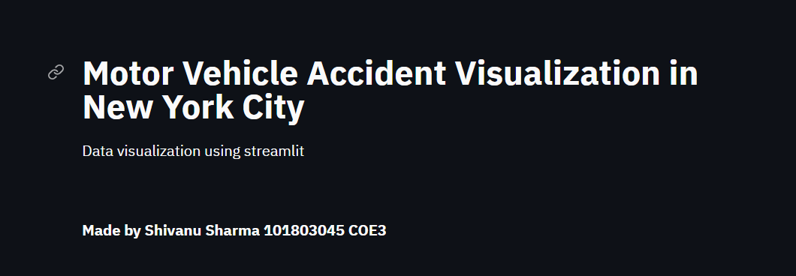
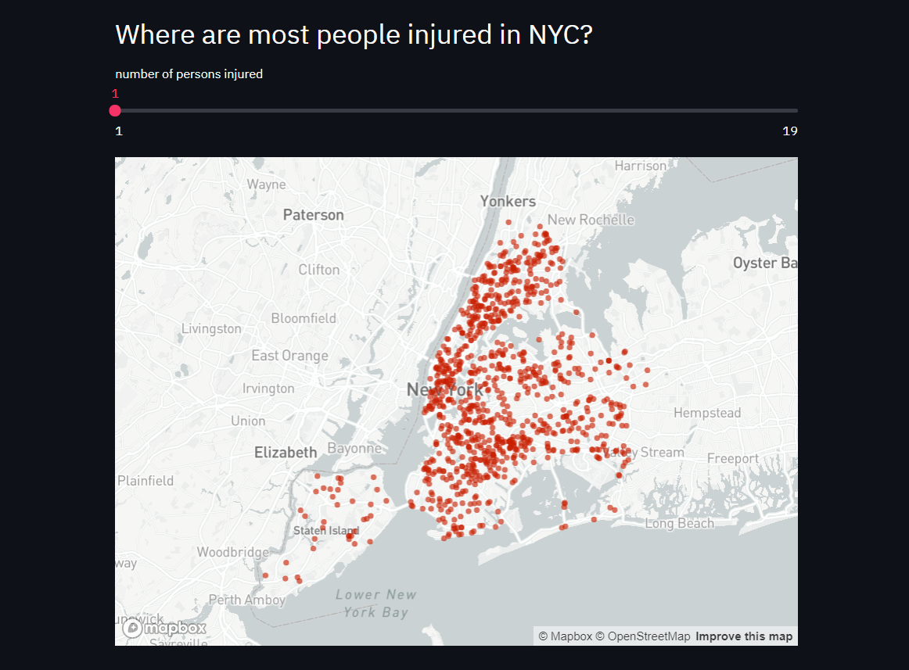
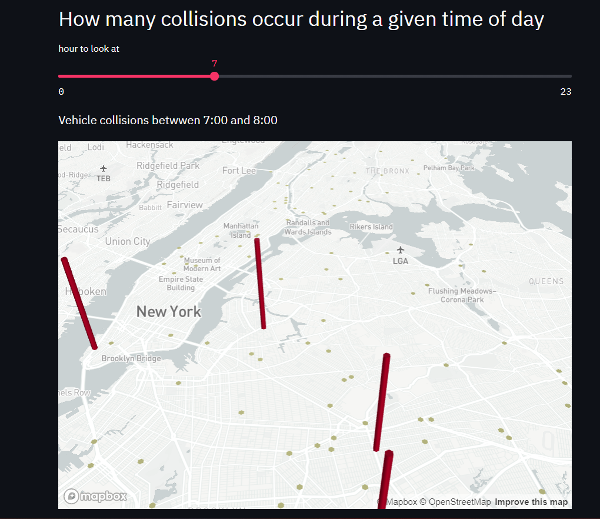
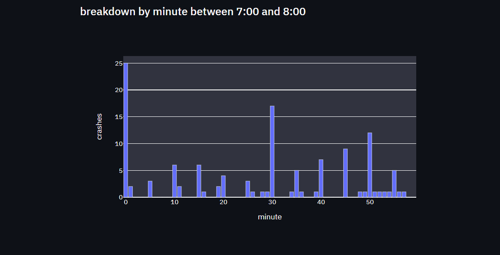
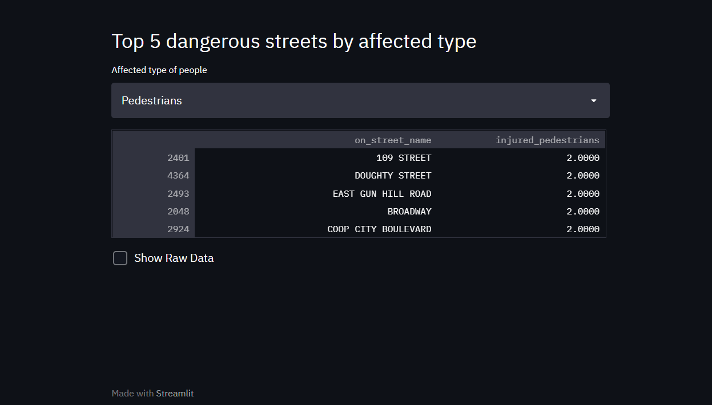

# NewYorkAccidentVisualization
A streamlit Project for helping in data visualization of accidents occuring in New York.

Live link of website: https://newyorkaccidentvisualization.herokuapp.com/

# Screenshots of I/O

<table style="width:100%">
  <tr>
    <th></th>
    <th></th>
  </tr>
  <tr>
    <th></th>
    <th></th>
  </tr>
  <tr>
    <th></th>
  </tr>
 </table>

